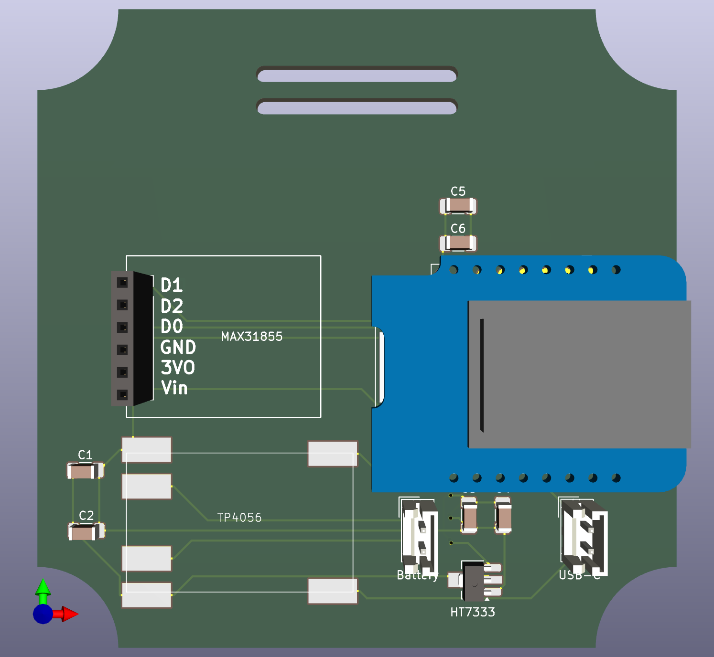

# BBQ Temperature Sensor Project

This project is a BBQ temperature sensor that allows you to monitor the temperature of your BBQ grill or smoker remotely. It uses a Thermocouple with a MAX31855 amplifier temperature sensor to measure the temperature and an ESP8266 (D1 Mini) microcontroller to send the data to a web server. The project is designed to be easy to set up and use.

## PCB Setup

For a more stable and compact design, a custom PCB was created. The PCB is designed to hold the D1 Mini microcontroller and the MAX31855 amplifier.

image:


## ESPHome Setup

The project uses ESPHome to manage the D1 Mini microcontroller. ESPHome is a system that allows you to control your ESP8266/ESP32 devices through simple yet powerful configuration files and control them remotely through Home Assistant.

```yml
esp8266:
  board: d1_mini

spi:
  miso_pin: D0
  clk_pin: D1

sensor:
  - platform: max31855
    name: "BBQ Temperature"
    cs_pin: D2
    update_interval: 10s
```
