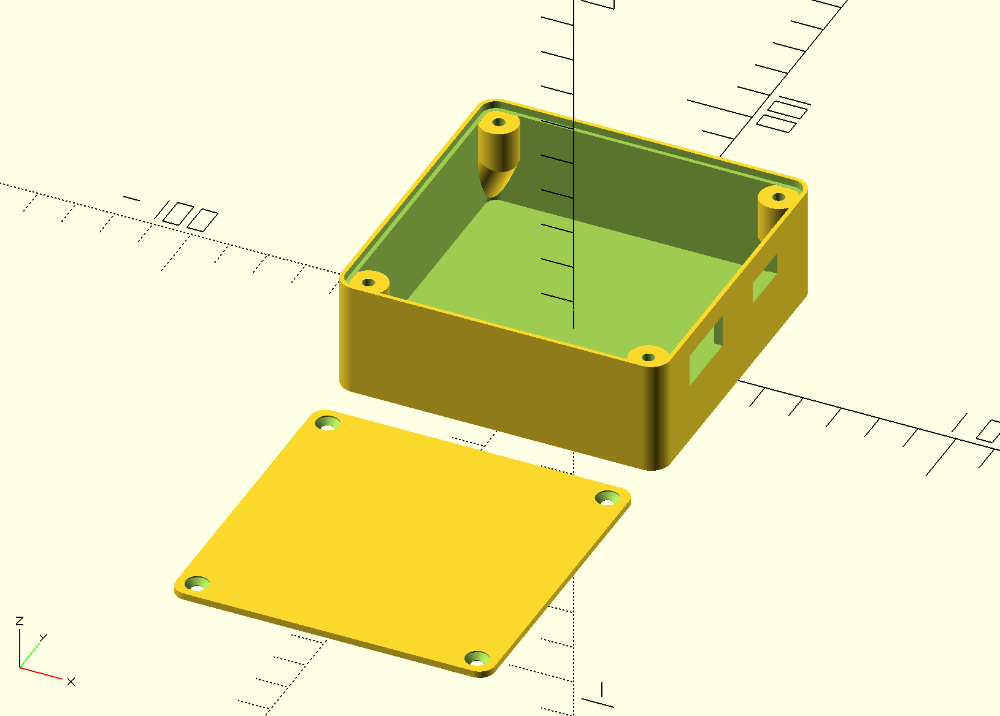

# BBQ Temperature Sensor Project

This project is a BBQ temperature sensor that allows you to monitor the temperature of your BBQ grill or smoker remotely. It uses a Thermocouple with a MAX31855 amplifier temperature sensor to measure the temperature and an ESP8266 (D1 Mini) microcontroller to send the data to a web server. The project is designed to be easy to set up and use.

## PCB Setup

For a more stable and compact design, a custom PCB was created. The PCB is designed to hold the D1 Mini microcontroller and the MAX31855 amplifier.

image:


## ESPHome Setup

The project uses ESPHome to manage the D1 Mini microcontroller. ESPHome is a system that allows you to control your ESP8266/ESP32 devices through simple yet powerful configuration files and control them remotely through Home Assistant.

```yml
esp8266:
  board: d1_mini

spi:
  miso_pin: D0
  clk_pin: D1

sensor:
  - platform: max31855
    name: "BBQ Temperature"
    cs_pin: D2
    update_interval: 10s
```

## Parametric Box

Thank you to [@pbtec_14016](https://www.printables.com/@pbtec_14016) for the original design of the box. The original design was modified to fit the PCB and the D1 Mini microcontroller. The box is designed to be 3D printed and has cutouts for the thermocouple and the D1 Mini microcontroller.



Only things changed from the original design are the Holes in the wall of the box for the cables, the count of screws for the lid, and the dimensions.
The box is designed to be printed in one piece, with no need for supports. The design is parametric, allowing you to easily adjust the dimensions to fit your needs.
